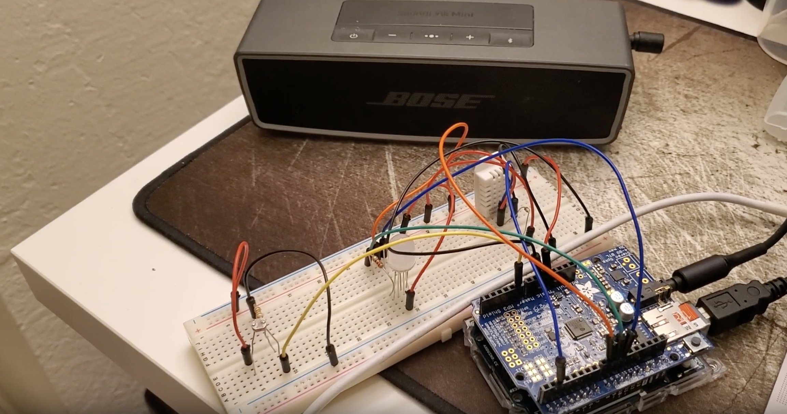
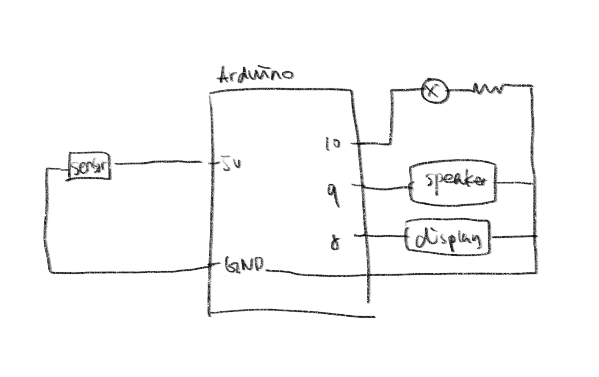
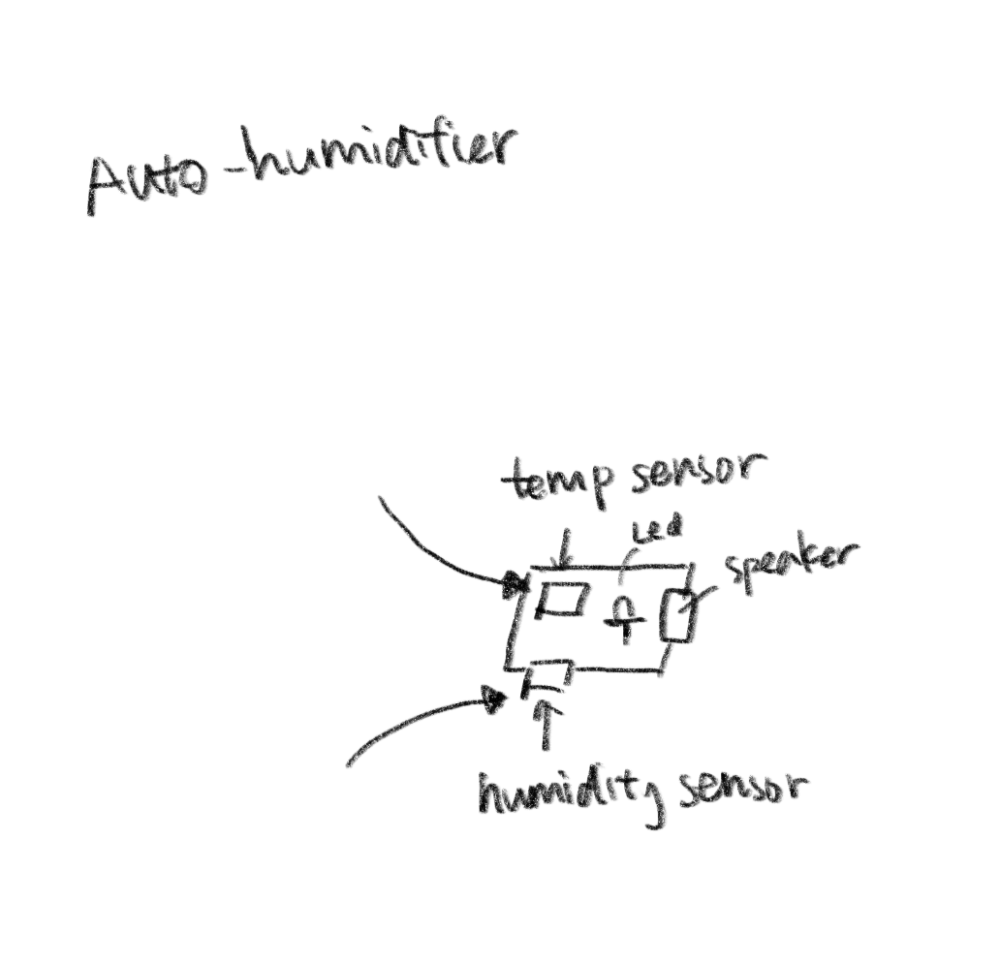
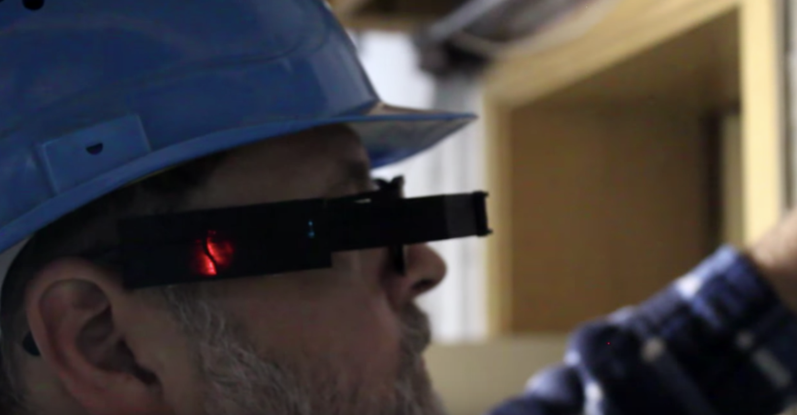

# Week Ten - Week Fourteen
## Final Project - Handwash Sensor
The final project will serve as a smart assistant to remind users to wash their hands during the pandemic season. Due to the shortage of parts, I will re-use parts from the midterm project to deliver a similar effect to the desired deliverable. The project will have two features. Firstly, the sensor will detect if the user has leave the house. If so, the sensor will remind the user to wash their hands when they are back. The second feature will be a reminder at the sink. After the user is back, the sensor will remind the user to wash their hands until the user approaches the sensor and finish the handwashing process. 

The project aims to help people to stay safe during the coronavirus outbreak. With simple parts and assemble instructions, everyone can afford a smart reminder. 

### Scenarios
### MVP Version
The MVP will be divided into four pieces. The LDR sensor will serve as a substitute for the distance sensor / RFID due to the fact that it can be difficult to acquire them now. The LED will signify action detection. It will change to red color if anyone enters the house. I will keep using the speaker to trigger the sound notification.
* LDR (Distance sensor/RFID)
* LED Light
* Mp3 Shield
* Speaker

### Nice-to-have Features
* Identify who is back and remind them to wash their hands (Unique ID)
* Check if the user has washed their hands for at least 20 seconds
* Check if the user is washing in the right way

### Electric Schematic

# Week Four - Week Eight
## Midterm Project - Auto-humidifier
My first iteration works well as the final product. The device will not only ask Alexa to turn on the humidifier when it detects low humidity but also will tell the user how is the weather via the LDR sensor. Also, with the indication of LED, the user can immediately know if the current humidity is high or low. 

### Quick Demo

### Video Demo

Please refer this link to the complete video demo:
https://youtu.be/iU1KX62NXqY

### Electric Schematic
  

### Code
The code is available in the midterm folder. :)

### Punch List
#### Essential
* Detect the humidity ✅
* Detect the temperature ✅
* Make speaker play a recorded sound ✅
* Make the RGB light for low and high humidity ✅

### Steps
#### Preparation
* DHT22 Sensor * 1
* Adafruit Mp3 Shield * 1
* LDR Sensor * 1
* RGB LED * 1
* Micro SD Card > 64MB * 1
* Speaker * 1
#### Assemble
* Solder the Mp3 Shield to female and male pins
* Record voice files for weather and humidity
* Name the files as "trackXXX.mp3" eg. track001.mp3
* Assemble DHT22, Mp3 Shield, RGB LED, and LDR Sensor 
#### Coding Time
* Test DHT22, Mp3 Shield, RGB LED, and LDR Sensor <b>Separately</b> with the built-in libraries
* Download the code from the Midterm Folder and test it out
#### Ta-Da ✴️
* Enjoy your smart device!

# Week Three
## Midterm Project - Auto-humidifier

### Project Description
I would like to create a device that will ask Alexa to turn on the humidifier when it detects low humidity and temperature. The input sensors will be a humidity sensor and a temperature sensor. The output sources will be a speaker and a RGB light. The speaker will tell Alexa to turn on the sensor while the LED will let the user know if the humidity is low, medium or high. 

The code will be based on receiving return values from these two sensors. Based on if statements, we will be able to categorize each return value and determine if we should turn on the humidifier or not. Also, we want to change the RGB light accordingly. 

### Electric Schematic
  

### Punch List
#### Essential
* Detect the humidity
* Detect the temperature
* Make speaker play a recorded sound
* Make the RGB light for low, med and high humidity

#### Nice-to-have
* Display the current humidity and temperature
* Draw an image for screen saver based on today's humidity and temperature
* Ask Alexa to do other works based on these two values

# Week Two
## Arduino project I found interesting:
https://www.youtube.com/watch?v=lkl6yVauCKg&feature=youtu.be

## Description: 
This is a Arduino Data Glasses that work together with the Multimeter Owon B35T. With the glasses, the engineer can easily get the voltage without looking at the multimeter, which make their live much easier.

# Week One
My favorite processing sketch from last semester

